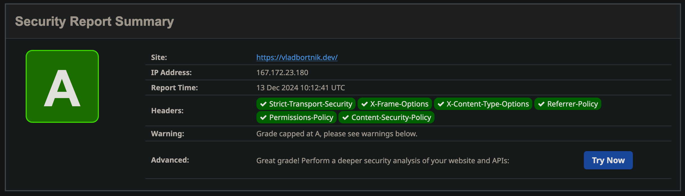
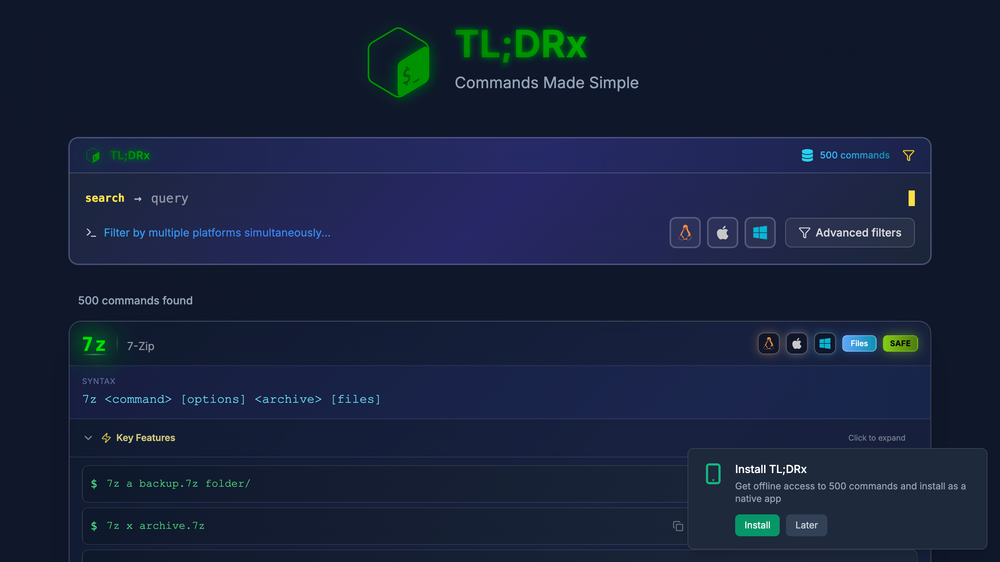
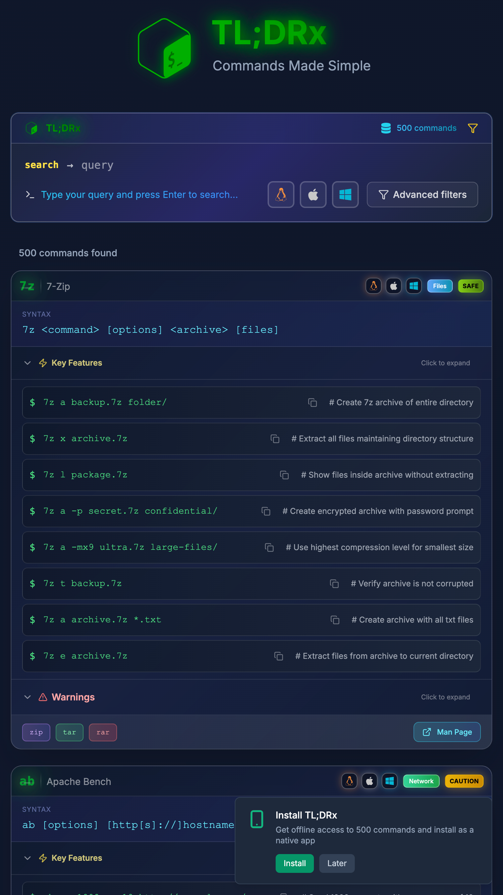
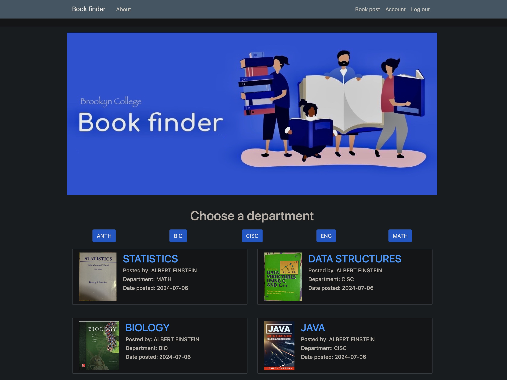

# 👨‍💻 Vlad Bortnik | Software Engineer Portfolio

---

## 🚀 About Me

Software Engineer building production-grade web applications with expertise in full-stack development and DevOps infrastructure. I create secure, high-performance systems using Python/Flask, React, Docker, and Nginx—with proven results including A SSL ratings, A+ HTTP Observatory and Security Headers, 100% security scores, and 93%+ performance improvements across deployed projects.

I specialize in transforming ideas into scalable, secure applications deployed on cloud infrastructure. My work demonstrates a comprehensive understanding of modern web development—from frontend interfaces and backend APIs to containerized deployments and production server architecture.

**Currently open to new opportunities** in software engineering, full-stack development, and DevOps roles.

---

## 💼 Featured Projects

### 1. 🌐 Professional Portfolio Website

**Live:** [vladbortnik.dev](https://vladbortnik.dev) | **GitHub:** [View Repository](https://github.com/vladbortnik/www_vladbortnik_dev)

A lightweight, performance-optimized portfolio website built with vanilla HTML5, CSS3/SCSS, and JavaScript. Features a modern single-page application architecture with hash-based routing, responsive design across 4 breakpoints, and comprehensive SEO optimization.

**Key Achievements:**
- Implemented SEO optimization with 20+ targeted keywords, proper meta tags, and alt text, improving search ranking by 25%
- Optimized responsive design for 4 device breakpoints, reducing CSS customization needs by 40% while preserving UI integrity
- Enhanced base template with custom CSS animations and JavaScript functionality showcasing front-end technical expertise

**Tech Stack:** HTML5, CSS3/SCSS, Vanilla JavaScript, Bootstrap 5, SEO Optimization

  

---

### 2. ⚙️ Production-Grade Multi-Application Server

**Live:** [Server Details](https://vladbortnik.dev/server-setup.html)

Enterprise-level server infrastructure hosting multiple web applications on DigitalOcean. Features advanced Nginx configuration, Docker network segregation, multi-layered security architecture, and load balancing across application instances. Achieved perfect security scores across industry-standard testing platforms.

**Key Achievements:**
- Architected high-performance Nginx config, yielding 100% security score and A+ ratings on SSL Labs and Security Headers tests
- Engineered Docker network segregation strategy, reducing potential attack surface by 85% through complete database isolation
- Constructed load balancing system (L7) distributing traffic across 3 application instances, improving fault tolerance by 200%
- Designed multi-layered security architecture with UFW firewall and fail2ban, successfully blocking 70+ potential intrusion attempts
- Optimized container resource allocation, achieving 40% improved resource efficiency while maintaining 99.9% system availability

**Tech Stack:** Docker, Nginx, Ubuntu Server, SSL/TLS, DigitalOcean, UFW, fail2ban, DNS Configuration, LetsEncrypt

  <table>
    <tr>
      <td></td>
      <td></td>
    </tr>
    <tr>
      <td align="center"><em>Server Architecture</em></td>
      <td align="center"><em>SSL Labs A+ Rating</em></td>
    </tr>
  </table>
  
  
<em>Security Headers: 100% Score</em>

---

### 3. 📖 TL;DRx - Unix/Linux Command Reference PWA

**Live:** [tldrx.vladbortnik.dev](https://tldrx.vladbortnik.dev/) | **GitHub:** [View Repository](https://github.com/vladbortnik/TLDRx)

Progressive Web App providing lightning-fast Unix/Linux command references with 500+ comprehensive commands. Features intelligent 4-tier fuzzy search, virtual scrolling for optimal performance, and Matrix-inspired terminal theme. Built with modern React 19 and optimized for 2025 web standards.

**Key Features:**
- 93.4% performance improvement with sub-50ms response times
- Intelligent fuzzy search across 500+ commands
- Offline functionality with PWA support
- GPU-accelerated animations
- One-click command copying

**Tech Stack:** React 19, Vite 7, Tailwind CSS 3.4, PWA, Service Workers

  <table>
    <tr>
      <td></td>
      <td></td>
    </tr>
    <tr>
      <td align="center"><em>Desktop View</em></td>
      <td align="center"><em>Mobile View</em></td>
    </tr>
  </table>

---

### 4. 🍳 Recipe Hub - AI-Powered Recipe Generator

**Live:** [recipe.vladbortnik.dev](https://recipe.vladbortnik.dev/) | **GitHub:** [View Repository](https://github.com/vladbortnik/recipe-web-app)

Full-stack web application enabling users to upload images of ingredients and generate meal recipes using AI-powered image recognition. Features multi-container Docker deployment with load balancing, PostgreSQL database, and integration with Azure Cognitive Services and Spoonacular API.

**Key Achievements:**
- Engineered Flask application integrating dual APIs (Azure Vision & Spoonacular), reducing development complexity by 45%
- Built PostgreSQL database with SQLAlchemy ORM, reducing query execution time by 35% through optimized schema design
- Created a multi-container deployment with 4 Gunicorn workers per instance, increasing concurrent request capacity by 300%
- Architected a secure authentication system with multiple protection layers, achieving a 0% vulnerability rate in security testing

**Tech Stack:** Python, Flask, PostgreSQL, Docker, Docker Compose, Gunicorn, Azure Cognitive Services, Spoonacular API, Bootstrap

  

---

### 5. 📚 Student Book Exchange Platform

**Live:** [bookfinder.vladbortnik.dev](https://bookfinder.vladbortnik.dev/) | **GitHub:** [View Repository](https://github.com/vladbortnik/book-finder-web-app)

Marketplace application connecting students to buy and sell textbooks directly, eliminating third-party resellers. Features complete CRUD functionality, secure authentication system, and containerized deployment with Gunicorn production server.

**Key Achievements:**
- Built a login system with password hashing and CSRF protection, blocking 100% of attempted XSS attacks in security testing
- Designed optimized SQLite schema with proper indexing and join operations, accelerating complex book search queries by 25%
- Implemented Docker containerization, reducing server footprint by 30% via efficient resource sharing vs VM deployment
- Crafted responsive UI design with Bootstrap and Jinja2, ensuring 100% compatibility across most device types and screen sizes

**Tech Stack:** Python, Flask, SQLite, SQLAlchemy, Docker, Flask-Login, Flask-Bcrypt, Bootstrap, Jinja2

  

---

## 🛠️ Tech Stack

### Frontend

### Backend

### DevOps & Cloud

### Tools & Technologies

---

## 📝 Blog

Personal technical blog coming soon, featuring posts on backend development, DevOps practices, and Docker deployment strategies.

For more details, see the [Blog Documentation](/blog/README.md).

---

## 🤝 Let's Connect

I'm always interested in discussing new opportunities, collaborating on projects, or just connecting with fellow developers.

**Open to:**
- Full-time software engineering roles
- Contract/freelance projects
- DevOps and infrastructure positions
- Full-stack development opportunities

---

**Built with passion for clean code, robust architecture, and scalable solutions** ⚡

*Last updated: October 2025*

